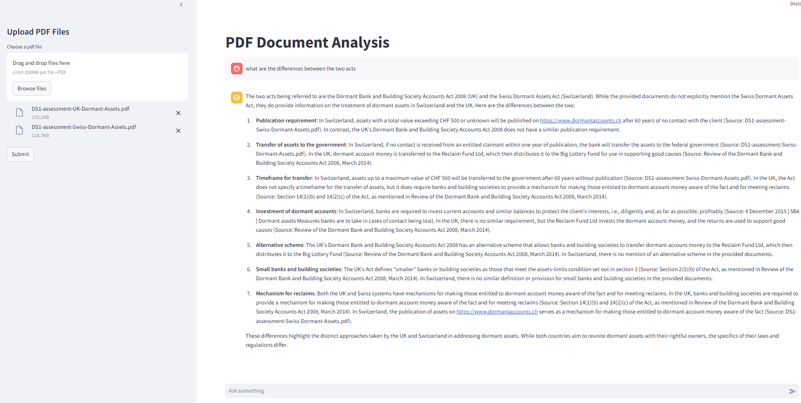

# MAS_AI_Model

## Overview
MAS_AI_Model is a Data Science Assessment to create a GenAI tool for policy makers to read and digest many different policies and reports quickly and accurately.



## Installation
Clone the repository and install dependencies:
```bash
git clone https://github.com/sihuii27/MAS_AI_Model
cd MAS_AI_Model
pip install -r requirements.txt
```
## Setup
To use the GROQ API, you need to set up your API key:

1. Obtain your GROQ API key from [GROQ's website](https://groq.com/) after registering an account.
2. Create a file named `.env` in the root directory of your project.
3. Add the following line to your `.env` file, replacing `YOUR_GROQ_API_KEY` with your actual key:
    ```
    GROQ_API_KEY=YOUR_GROQ_API_KEY
    ```
4. Save the `.env` file. Streamlit application will now be able to access the GROQ API key securely.

## Usage
Describe how to run your project:
```bash
cd MAS_AI_Model
streamlit run src/app.py
```
## Questions
Limitations of free/open source models.

The performance of free/open source models can be slower compared to optimized models. In terms of Llama 3.3 70B, it is only able to analyze text and not images, audio or video processing. Since it is free and open source, its reasoning capability and accuracy can be weaker than paid third part APIs.

Explain in detail how you would make used of paid third-party APIs if made available to you.

With paid APIs available like Google Cloud Document AI, I will be able to analyze complex images or statistics in diagrams within complex pdf file. Handle scanned documents and images within PDFs with high accuracy, extract metadata like document creation dates, authors, and revision history. Additionally, paid GPT models like GPT 4, GPT 4 Turbo they can offer better performance. I could use it to better understand the relationship between the images, text and diagram in documents.